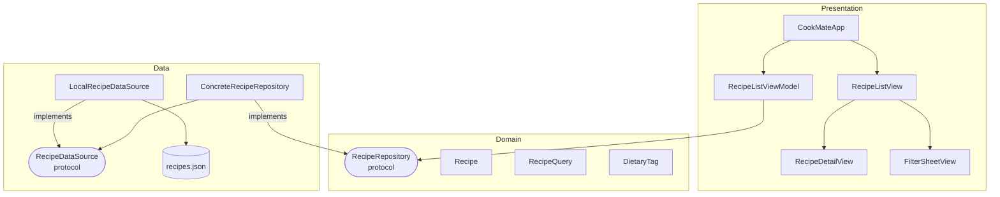

# CookMate

A native iOS recipe browsing app built with Swift and SwiftUI.

## Setup

1. Clone the repository
2. Open `CookMate.xcodeproj` in Xcode 26+
3. Select an iOS 26 simulator
4. Press ⌘R to build and run — no dependencies to install

## Architecture

MVVM + Clean Architecture with strict layer separation.

- **Domain** — pure Swift. `Recipe`, `RecipeQuery`, `DietaryTag`, `RecipeRepository` protocol. Zero external dependencies.
- **Data** — `ConcreteRecipeRepository` passes the full `RecipeQuery` to `RecipeDataSource` (protocol), maps `RecipeResponse` → `Recipe`, and applies all query filters. `LocalRecipeDataSource` ignores the query and returns the full dataset; a remote implementation would serialize the query into URL query items and let the server filter instead.
- **Presentation** — `RecipeListViewModel` (@Observable) owns query state, debounces input, calls the repository. Views are driven by the ViewModel.

Swapping the local JSON for a real API requires one new `RecipeDataSource` conformer — the repository, ViewModel, and views are unchanged. The conformer receives a `RecipeQuery` and is responsible for translating it into the appropriate request parameters.

## Key Design Decisions

**`RecipeDataSource` protocol over concrete type**
`ConcreteRecipeRepository` depends on the protocol, not `LocalRecipeDataSource`. The protocol accepts a `RecipeQuery`, mirroring the contract a real API endpoint would have. Swapping implementations (local ↔ remote) requires no changes to the repository or above. The repository is also testable via a `MockRecipeDataSource`.

**No service layer**
A service layer was considered but removed — it was a pure passthrough with no added value. The ViewModel depends directly on `RecipeRepository`. A service layer would be introduced if multiple repositories needed orchestrating.

**`RecipeQuery` uses `[DietaryTag]` not `Set`**
Preserves insertion order (useful for displaying active filters). Uniqueness enforced via `toggleTag(_:)`.

**`RecipeListViewModel.State` enum over scattered booleans**
The ViewModel exposes a single `state: State` (`loading`, `loaded`, `empty`, `error`) instead of separate `isLoading`, `recipes`, and `error` properties. This eliminates impossible states (e.g. `isLoading=true` alongside `error != nil`) and lets the view use an exhaustive `switch` with no nested conditions. `CancellationError` is explicitly ignored so a cancelled in-flight search never flashes an error UI.

**Debounce via Task cancellation**
Real-time search debounce is implemented by cancelling the previous `Task` before sleeping 300ms. No Combine dependency needed.

**No ViewModel on detail screen**
The recipe is already in memory, passed as a value. A ViewModel would be empty boilerplate.

## Assumptions & Tradeoffs

- No image URLs — placeholder color blocks are derived deterministically from recipe ID
- Ingredient matching is substring-based (case-insensitive), not exact
- Servings filter means "at least N", not exact match
- Filtering is applied by `ConcreteRecipeRepository` after the full dataset is returned — appropriate for local JSON. A remote `RecipeDataSource` would serialize the query into URL query items and delegate filtering to the server.
- No persistence — no favourites or user data
